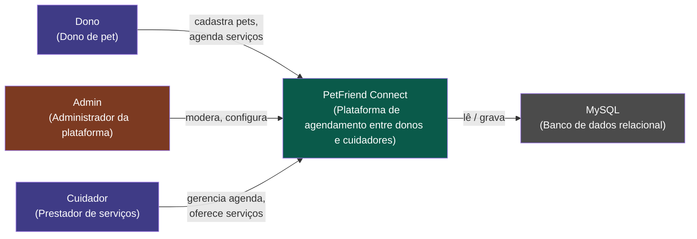
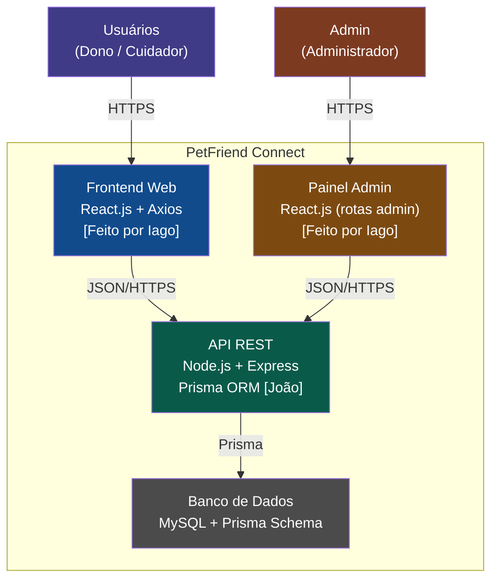
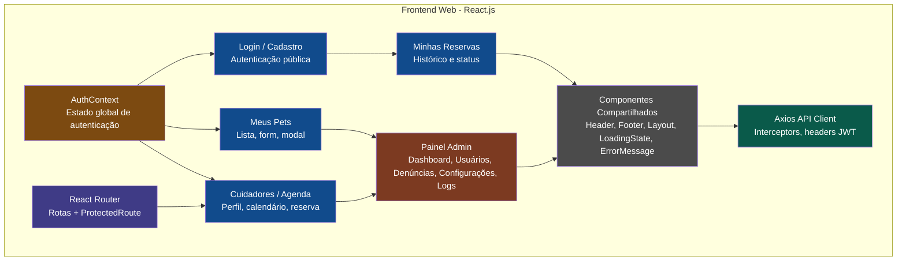
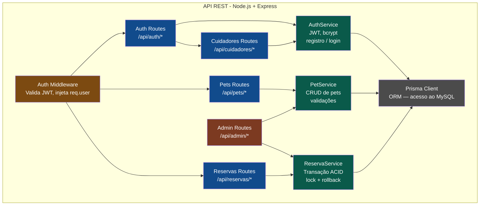
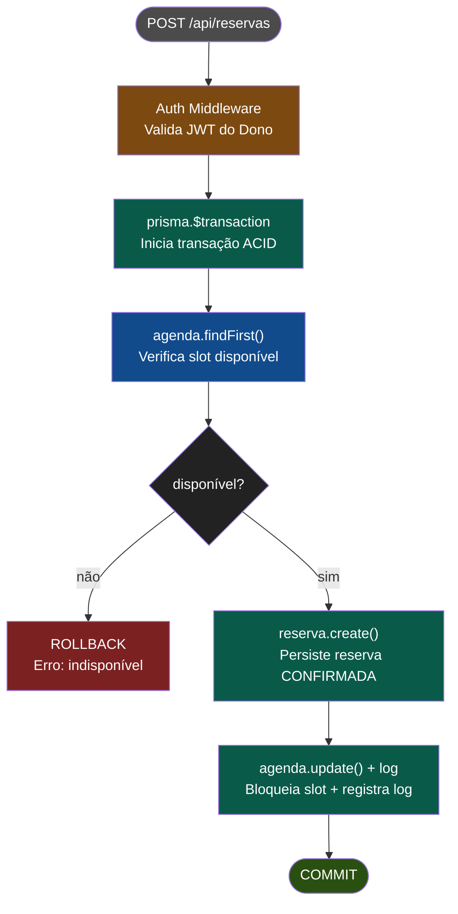

# C4 Model - PetFriend Connect

## Nível 1 — System Context
Quem usa o sistema e com quais sistemas externos ele se conecta.

## Nível 2 - Container Diagram
Quais são os blocos de execução do sistema: frontend, backend e banco.

## Nível 3 - Componentes do Frontend React
Páginas, componentes e contextos do React.

## Nível 3 — Componentes da API REST (Backend)
O que existe dentro da API REST — rotas, serviços e middleware.

## Nível 4 — Code (Transação ACID)
O detalhe mais granular: a lógica crítica da criação de reserva.
